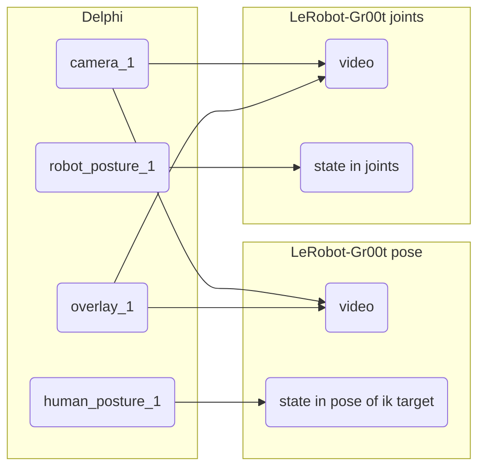

## DelphiToLeRobot



### Delphi => LeRobotDataset

Change `sys.path.append("/home/...)` to your LeRobot install.

Turns a dataset downloaded from Delphi (with given version) to a LeRobotDataset of desired format (change `DatasetProcessor` constructor to change the format).
```
Usage: python3 convert_dataset.py <input_dataset_path> <repo_id> <output_dataset_path>
```

#### Annotation
To make a pass over a dataset output from above, we (regrettably - this should change) match the episodes in the parquets to the raw annotions from earlier.
```
python3 dataset_annotator.py <lerobotdataset> <input_dataset_path> (--dry-run)
```
Verify with:
```
python3 verify.py <lerobot data file> # e.g. lerobotdataset/data/chunk-000/file-000.parquet
```

### Compositor
Composites a raw video with a robot overlay, downloaded from delphi.
```
Usage: python3 composite.py <raw_video> <robot_overlay>
```

